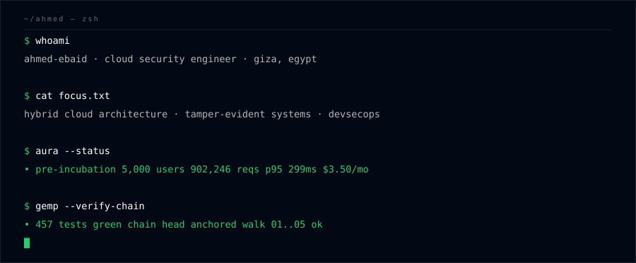

<picture>
  <source media="(prefers-color-scheme: dark)" srcset="assets/header-dark.svg">
  <source media="(prefers-color-scheme: light)" srcset="assets/header-light.svg">
  
</picture>

  <a href="https://ahmadebaid001.github.io/personal-portfolio/"><b>Portfolio</b></a> &nbsp;·&nbsp;
  <a href="https://www.linkedin.com/in/ahmed-ebaid-0xc/">LinkedIn</a> &nbsp;·&nbsp;
  <a href="https://github.com/AhmadEbaid001/personal-portfolio/raw/main/Ahmed_Mohamed_Ebaid_Resume.pdf">Résumé</a> &nbsp;·&nbsp;
  <a href="mailto:ahmedebaid0xc@gmail.com">ahmedebaid0xc@gmail.com</a>

<picture>
  <source media="(prefers-color-scheme: dark)" srcset="assets/terminal-dark.svg">
  <source media="(prefers-color-scheme: light)" srcset="assets/terminal-light.svg">
  
</picture>

I build systems that can **prove they still work** — hybrid architectures that fail over
without anyone watching, and stores that can walk a chain of records back and say exactly
where trust ends.

B.Sc. in Computational Science and Artificial Intelligence from Zewail City, majoring in
Information Technology with a concentration in Networks, Security and Governance.
Graduated July 2026.

<table>
<tr>
<td width="33%" valign="top">

**Now**

Building **AURA** with three teammates — a university registration platform that started as
our graduation project and is now in a pre-incubation programme.

</td>
<td width="33%" valign="top">

**Next**

**AWS Certified Security — Specialty** (SCS-C02), building on the Defending AWS work and
the IAM/VPC design in AURA.

</td>
<td width="33%" valign="top">

**Open to**

Cloud security and security engineering roles. Giza, Egypt — remote or on-site.

</td>
</tr>
</table>

---

## Selected work

### AURA — Academic University Registration Architecture

Private repository · [see it on the portfolio](https://ahmadebaid001.github.io/personal-portfolio/#aura)

Multi-tenant SaaS for university registration, scheduling and grading. Four-person team at
Zewail City; nominated for the Medal of Excellence in Entrepreneurship. Runs on a
self-hosted server in Egypt and bursts into Azure only when the on-premises node saturates.

I worked in the application and security layer: registration and semester-period scoping,
the professor dashboard, the grade-change workflow with dean approval, multi-tenant
isolation by `university_id`, and remediation of the critical and high findings from code
scanning.

`React 19` `Node 22` `Express 5` `PostgreSQL 17` `Socket.IO` `Redis` `HAProxy` `Cloudflare` `Azure Container Apps` `WireGuard`

<table>
<tr>
<td align="center"><b>5,000</b> concurrent users</td>
<td align="center"><b>902,246</b> requests, 100% success</td>
<td align="center"><b>299.55&nbsp;ms</b> p95 at peak</td>
<td align="center"><b>$3.50/mo</b> total infrastructure</td>
<td align="center"><b>13</b> pentest findings fixed</td>
</tr>
</table>

### EcoForge GEMP — Green Energy Monitoring Platform

Private repository · [see it on the portfolio](https://ahmadebaid001.github.io/personal-portfolio/#gemp)

Budget allocator for public-building retrofits, built for RoboDam 2026. Sole engineer on a
two-person team — domain model, telemetry ingestion, optimisation engine, API and front end.

Every meter reading is HMAC-signed and hash-chained on arrival, with chain heads anchored
outside the database volume, so an altered *or* truncated record is detected. RBAC with an
audit log that records denied actions as well as permitted ones. The CI pipeline blocks on
any finding from Bandit, Semgrep, pip-audit, Gitleaks, Hadolint or Trivy, and every security
exception carries an expiry date that fails the build once it lapses.

`Python` `FastAPI` `Docker` `TimescaleDB` `MQTT` `OR-Tools CP-SAT` `nginx`

<picture>
  <source media="(prefers-color-scheme: dark)" srcset="assets/chain-dark.svg">
  <source media="(prefers-color-scheme: light)" srcset="assets/chain-light.svg">
  
</picture>

### [OtterCTF 2018 — Ransomware Memory Forensics](https://github.com/AhmadEbaid001/OtterCTF2018-Forensics)

Four-phase memory forensics investigation of a Windows 7 host compromised by a
torrent-delivered ransomware payload. I led the engagement: kill chain reconstruction,
MITRE ATT&CK mapping, and the prevention write-up.

`Volatility` `Memory forensics` `MITRE ATT&CK`

### Also built

| Project | What it is |
|---|---|
| [Secure Communication Protocol](https://github.com/AhmadEbaid001/Secure-Communication-with-RSA-and-Symmetric-Encryption) | RSA-2048 key exchange, AES-GCM authenticated encryption, RSA-PSS signatures, HKDF-SHA256 forward secrecy |
| [Backup &amp; Disaster Recovery Framework](https://github.com/AhmadEbaid001/DR-Framework) | Zero-touch backups at a 24-hour RPO, AES-256 at rest, 148 Mbps with zero packet loss |
| [Enterprise Data Center Network](https://github.com/AhmadEbaid001/Green-Datacenter-Design-Project) | Three-tier design for 600+ users, OSPF, dual-ISP redundancy, VLSM, SNMPv2c |
| [Personal portfolio](https://github.com/AhmadEbaid001/personal-portfolio) | Static single-page site — no framework, no build step, three interactive figures |

---

## Toolbox

<picture>
  <source media="(prefers-color-scheme: dark)" srcset="assets/marquee-dark.svg">
  <source media="(prefers-color-scheme: light)" srcset="assets/marquee-light.svg">
  
</picture>

<table>
<tr><td><b>Cloud &amp; infrastructure</b></td><td>AWS (IAM, VPC, Security Groups, Load Balancer) · Azure Container Apps · hybrid cloud · Docker · nginx · HAProxy · WireGuard</td></tr>
<tr><td><b>DevSecOps</b></td><td>GitHub Actions security gating · Bandit · Semgrep · pip-audit · Gitleaks · Trivy · Hadolint · container image signing</td></tr>
<tr><td><b>Security domains</b></td><td>Vulnerability assessment · incident response · SIEM operations · threat modelling (MITRE ATT&amp;CK, STRIDE, PASTA) · encryption &amp; key management · RBAC · audit logging · data integrity (HMAC, hash chaining)</td></tr>
<tr><td><b>Security tooling</b></td><td>Nessus · Splunk · Wireshark · Nmap · Snort · Volatility · Autopsy</td></tr>
<tr><td><b>Networking</b></td><td>Network design &amp; installation · firewalls · VLANs · OSPF · VLSM · SNMP · MQTT · CCNA/CCNP track</td></tr>
<tr><td><b>Languages</b></td><td>Python (FastAPI, pytest) · JavaScript (React, Node, Express) · Bash · SQL · C++</td></tr>
<tr><td><b>Data &amp; platforms</b></td><td>PostgreSQL · TimescaleDB · Redis · Linux (Ubuntu, Kali) · EVE-NG · Cisco Packet Tracer</td></tr>
</table>

---

## Certifications &amp; experience

<table>
<tr><td valign="top" width="50%">

| Credential | Issuer | Year |
|---|---|---|
| Information Security Analyst | DEPI · MCIT | 2026 |
| Security Engineer · DevSecOps · Defending AWS | TryHackMe | 2026 |
| Google Cybersecurity Professional | Coursera | 2023 |
| AWS Security — Specialty | AWS | *in progress* |

</td><td valign="top" width="50%">

| Role | Where | When |
|---|---|---|
| Security Intern | CIB | Jul – Aug 2025 |
| Network Intern | Zewail City IT | Jul 2024 – Jan 2025 |
| Teaching Assistant | Zewail City | Sep – Dec 2024 |
| IT Representative | Student Parliament | Sep 2023 – Sep 2024 |

</td></tr>
</table>

---

## Activity

<picture>
  <source media="(prefers-color-scheme: dark)" srcset="https://raw.githubusercontent.com/AhmadEbaid001/AhmadEbaid001/output/snake-dark.svg">
  <source media="(prefers-color-scheme: light)" srcset="https://raw.githubusercontent.com/AhmadEbaid001/AhmadEbaid001/output/snake-light.svg">
  
</picture>

  
  

  

---

  The figures above are hand-written SVG, generated by
  <a href="assets/generate.py"><code>assets/generate.py</code></a> and served from this
  repository — animated with SMIL, no scripts, light and dark variants.

  <b>Giza, Egypt</b> · open to cloud security roles ·
  <a href="mailto:ahmedebaid0xc@gmail.com">ahmedebaid0xc@gmail.com</a>

